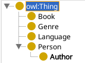
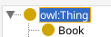
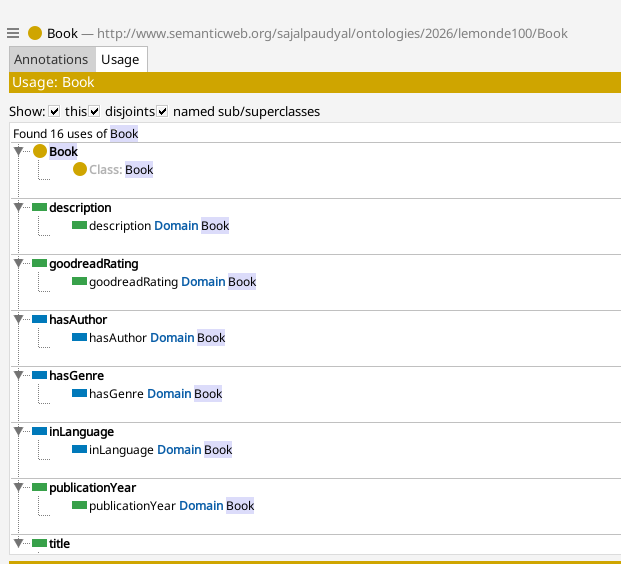

# Protégé introduction and Basics

This is what we want to create in protégé for creating an OWL ontology.



## Step 1: Verify the base IRI

Before starting to create any class we need to set a base IRI.

our IRI is

```text
http://www.semanticweb.org/sajalpaudyal/ontologies/2026/lemonde100
```

## Step 2: Creating a Class

owl:Thing is the **root** of the ontology. Every single class we create should eventually track back to owl:Thing.

**Top level class - Book**

This is the class that sits under owl:Thing

- Go to _Entities_ tab -> _Classes_
- In the class hierarchy on the left, click on owl:Thing and click **Add Class** button under the toolbar.
- A new class will appear in a box, and rename class to _Books_.

We will then have




Similarly create other three classes **Genre, Language,** and **Person**.

## Step 3: Creating a SubClass

Now we create the hierarchy where Author ill be the subClass under Person.

- Click on _Person_ under the _owl:Thing_ _Entities_ -> _Classes_
- Click **Add Subclass** which appears on the tab bar similar to _Add Class_
- On the popup that appears rename the new subclass to _Author_.

## Step 4: Creating Properties

We will create two types of properties as described in the basics for Owl.

1. **Object Properties**: Connect two classes ex. `Book` -> `Author`
2. **Data Properties**: Connect a class to data ex. `Book` -> `1984`

### Create object properties

- Go to the **Entities** tab -> **Object Properties**
- Click on `topObjectProperties` this is significant to `owl:Thing` of properties.
- Click `Add sub property` (using + button)

#### Create property 1: hasAuthor

- Rename the new property to `hasAuthor`
- Click on `hasAuthor` and on the description on the right panel
  - Find the row labeled `Domain` click on the + sign and select `Book`
  - Find the row labeled `Range` click on the + sign and select `Author`
    _This step confirms: Only the book can have this property, and it must point only to Author_

#### Similarly create "hasGenre" and "inLanguage"

### Create data properties

- Go to **Entities** tab -> **Data Properties**
- Click on `topDataProperties`
- Click `Add sub property`

#### Create property 1: title

- Rename the property to `Title`
- Set Domain to `Book`
- Set the range to and select the `Datatype` icon. Select `xsd:String`

#### Similarly create "publicationYear", "goodReadsRating", "description"

You will see a structure like following in your Protégé on the `Book` class.

